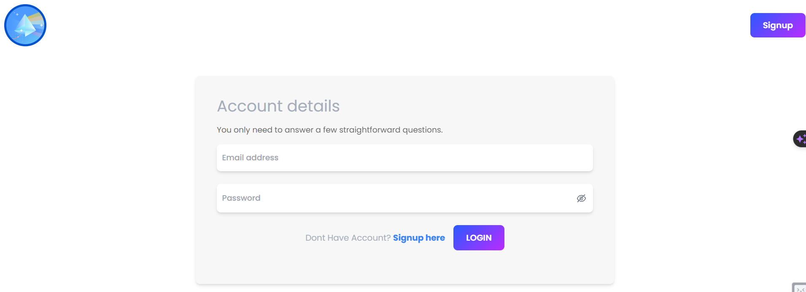
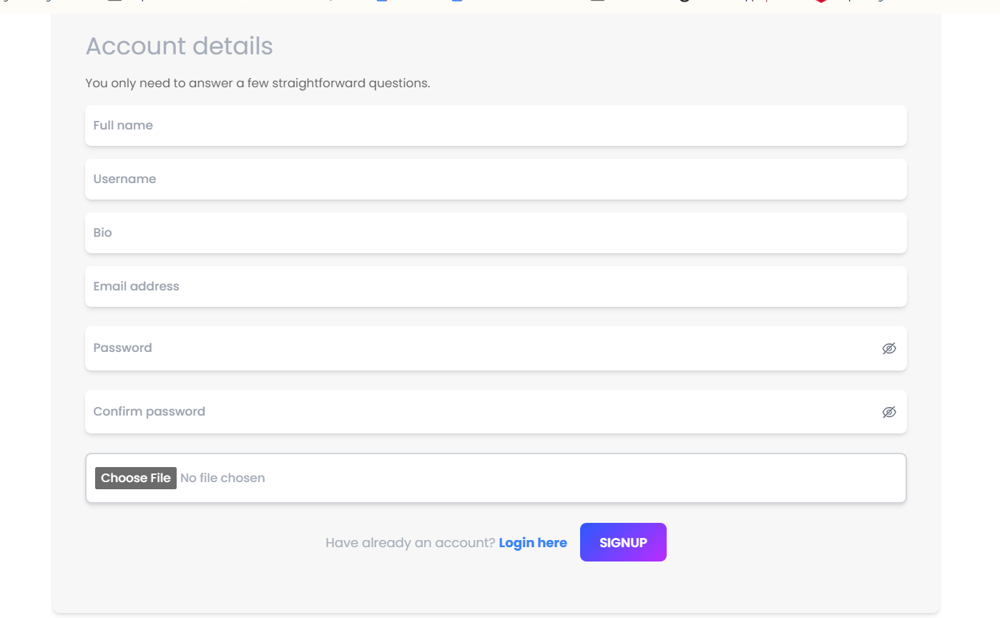
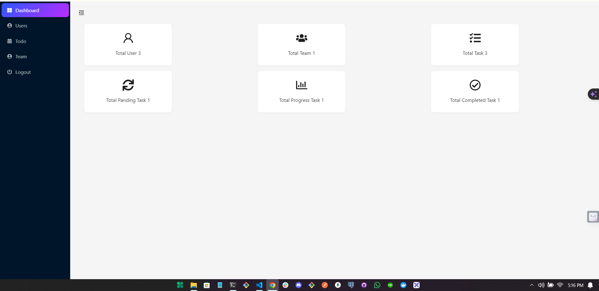
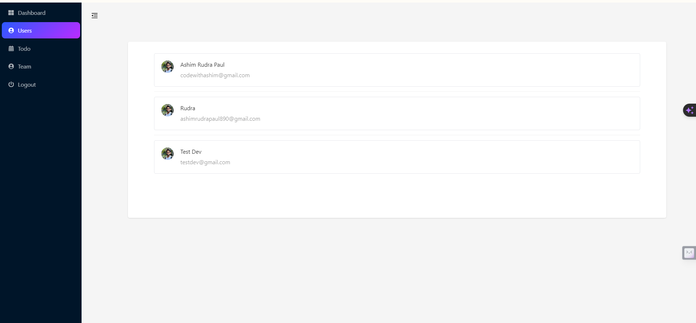
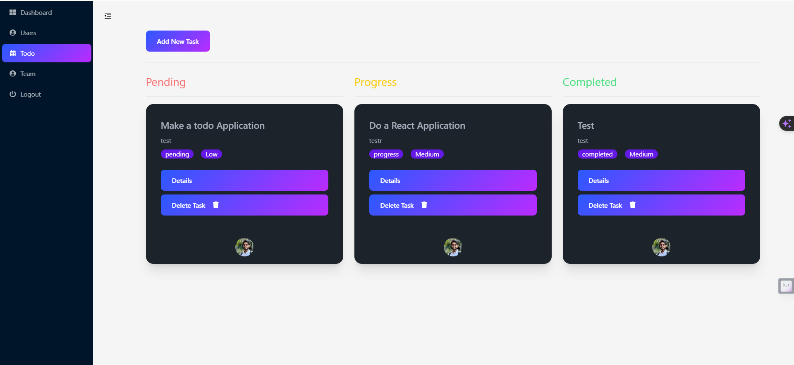
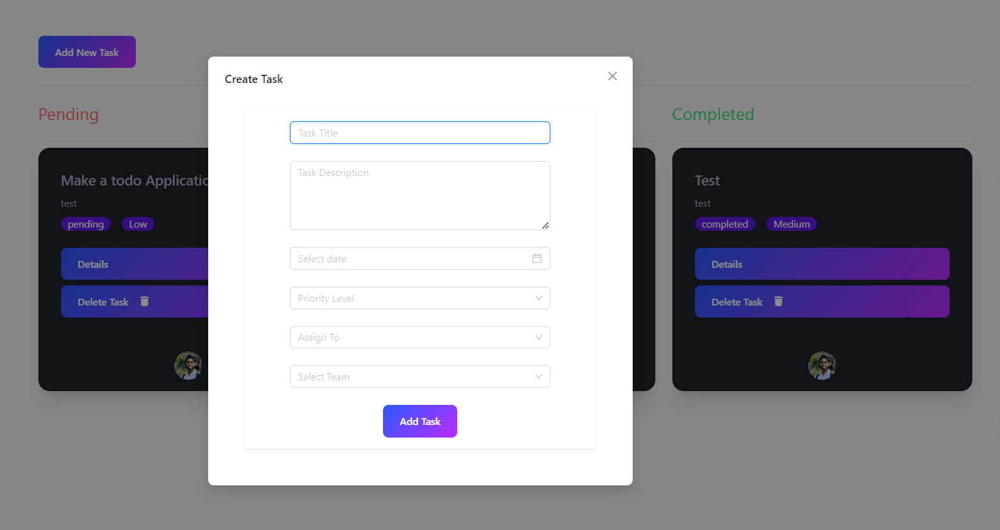
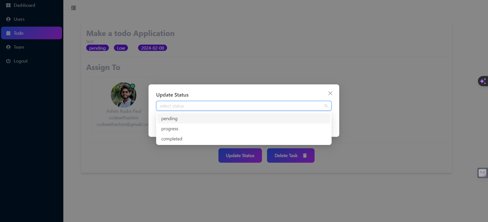
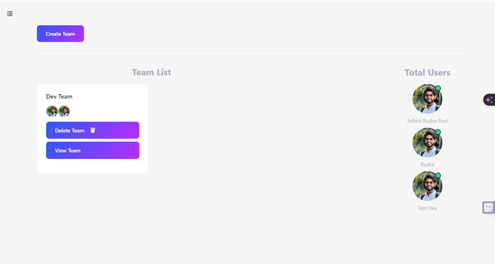
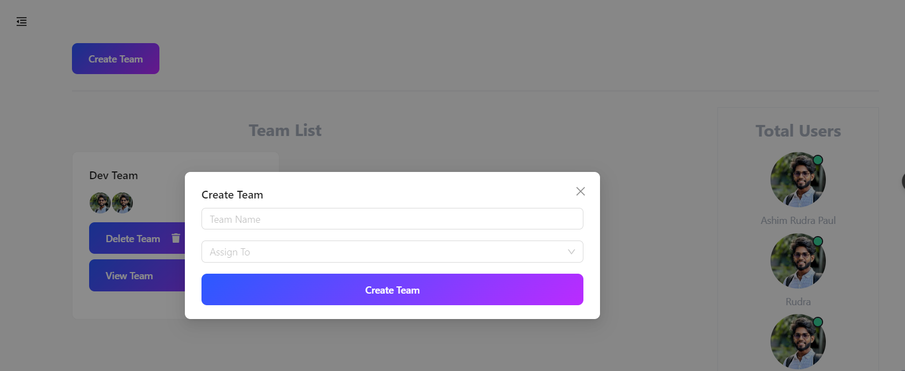

# Todo App

Live Link : https://todoist-by-ashim.netlify.app/

Server Link : https://todo-server-seven-snowy.vercel.app/api/v1/

==========================================

Client Github Link  : https://github.com/codewithashim/todo-frontend.git

Server Github Link : https://github.com/codewithashim/todo-backend.git

==========================================

Login User : codewithashim@gmail.com

Password : 123456

==========================================

Application Setup :

    Client :

```
git clone https://github.com/codewithashim/todo-frontend.git 
```

```
cd todo-frontend
```

```
npm install
```

```
npm run dev
```

   Server :

```
git clone https://github.com/codewithashim/todo-backend.git 
```

```
cd todo-backend
```

```
yarn install
```

```
yarn dev
```

============================================



















